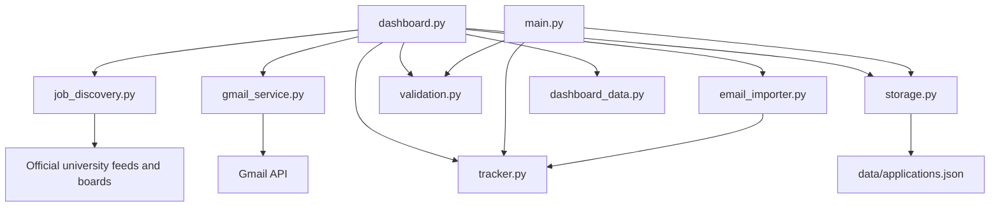
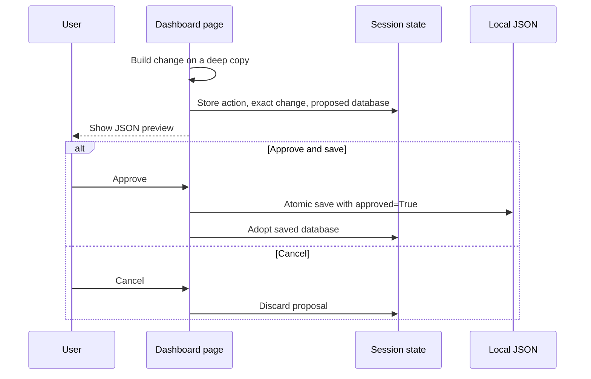

# Architecture

This document explains how the University Job Tracker works and why its parts
are separated. It is intended for developers who need to maintain or extend the
project.

## System boundaries

The application is a local, single-user Streamlit dashboard with an educational
CLI. It reads public university job boards and a user-authorized Gmail mailbox.
It stores approved records in one local JSON document.

The system does not submit job applications. It opens the original job posting
for the user. It does not send email. Its Gmail permission is read-only.

## Component diagram



## Module responsibilities

| Module | Responsibility |
| --- | --- |
| `dashboard.py` | Page navigation, widgets, tables, charts, session state, and approval UI |
| `job_discovery.py` | Public-source configuration, HTTP retrieval, RSS/Atom/Workday parsing, role matching, filters, and deduplication |
| `gmail_service.py` | OAuth token handling, Gmail queries, pagination, MIME decoding, and normalized message retrieval |
| `email_importer.py` | Email classification, role/employer extraction, conservative record matching, and import plans |
| `tracker.py` | Pure in-memory application, status, reminder, summary, and outreach operations |
| `validation.py` | Required fields, dates, allowed statuses, email format, and search-goal validation |
| `storage.py` | Database defaults, compatibility defaults, JSON loading, and atomic approved writes |
| `dashboard_data.py` | Application and outreach CSV serialization |
| `main.py` | Original CLI and text-based approval loop |

## State and memory

The project uses two kinds of state.

### Streamlit session state

`st.session_state` is short-lived working memory for:

- the loaded database;
- a proposed change waiting for approval;
- a Gmail scan plan;
- the selected page; and
- one-time success or cancellation messages.

Session state prevents a proposed write from occurring inside a form handler. A
handler builds the proposal, stores it in session state, and reruns the page so
the user can inspect it.

### Local JSON

`data/applications.json` is long-term memory. `storage.load_database` adds
missing top-level keys so older local files continue to work when the schema
grows. `storage.save_database` requires `approved=True`, writes a temporary
file, and then replaces the database file. This avoids leaving a partially
written JSON file if a process fails during output.

## Approval-gated write flow



Reads, calculations, filters, and public-source searches are reversible and do
not require approval. JSON writes always use this flow.

## Database schema

The top-level JSON object has this shape:

```json
{
  "search_goal": null,
  "applications": [],
  "outreach_history": [],
  "job_leads": [],
  "job_discovery": {
    "last_scan_at": null,
    "sources": []
  },
  "email_sync": {
    "start_date": "2025-06-01",
    "last_scan_at": null,
    "processed_message_ids": []
  }
}
```

### Application record

| Field | Meaning |
| --- | --- |
| `id` | Locally generated unique ID |
| `company_name` | University or employer extracted from email |
| `role_title` | Position title extracted from email |
| `job_id`, `location`, `job_url` | Optional posting details |
| `date_applied` | Confirmation-email date |
| `status` | `applied`, `interviewing`, `offer`, `rejected`, or `withdrawn` |
| `sponsorship_status` | `confirmed`, `not_available`, or `unclear` |
| `stem_opt_evidence`, `h1b_evidence` | Source text or notes supporting the status |
| `source_email_id`, `source_thread_id` | Gmail deduplication and matching keys |
| `last_status_email_id`, `last_email_date` | Audit fields for the latest change |
| `follow_up_date` | Seven days after applying by default |
| `notes` | Short source note; never the full email body |

### Job lead record

| Field | Meaning |
| --- | --- |
| `id` | Stable SHA-256 prefix derived from the original URL |
| `university`, `role_title`, `job_family`, `location` | Display and filter fields |
| `job_url` | Original official posting |
| `date_found`, `date_posted`, `posted_at` | Discovery and freshness timestamps |
| `summary` | Shortened verbatim excerpt from the original source description |
| `requirements` | Up to three requirement blocks copied from the source |
| `employment_type`, `requisition_id`, `closing_date` | Structured details exposed by the source |
| `sponsorship_status` | Conservative evidence state, initially `unclear` |
| `stem_opt_evidence`, `h1b_evidence` | Explicit evidence when available |
| `source` | Human-readable official source name |
| `status` | Lead state, initially `new` |
| `notes` | Verification guidance |

### Outreach record

Outreach records hold the contact, normalized email address, university, role,
application link, exact message, sent date, reply state, and follow-up date. The
email address is the duplicate-check key.

## Job discovery flow

1. `JOB_SOURCES` declares each official source and parser kind.
2. Sources are fetched concurrently with a bounded thread pool.
3. RSS, Atom, and Workday payloads are converted to one job-lead shape.
4. Matching detail payloads are read for descriptions, requirements, closing
   dates, and explicit sponsorship statements. The displayed excerpt keeps the
   source's original wording; the application does not generate a description.
5. `is_target_role` accepts target titles and rejects senior or management
   wording.
6. The original posting URL becomes the cross-scan deduplication key.
7. Live results are cached by Streamlit for 30 minutes.
8. Filters operate on live plus previously saved results, while job charts are
   rendered on the home dashboard.
9. New and enriched results are saved only through the approval gate.

One source failure does not discard successful sources. The Jobs page lists each
source error in an expandable warning.

Workday exposes relative dates such as `Posted Today` and `Posted 3 Days Ago`.
The parser converts those values relative to scan time. Dates marked `30+ Days`
are represented as 30 days before the scan and should be treated as approximate.

## Gmail import flow

1. `gmail_service.load_credentials` loads and refreshes the local OAuth token.
2. The user selects **Scan Gmail** with a starting date.
3. Gmail applies a broad application-related query and excludes `hackathon`.
4. The service downloads matching message metadata and bodies.
5. `email_importer.classify_job_email` excludes non-job events and detects an
   application state from conservative phrases.
6. An application confirmation proposes a new record.
7. A later status email matches by Gmail thread ID first, then exact normalized
   university and role.
8. Ambiguous messages go to **Needs review** and are not written.
9. The user reviews all proposed changes and approves or cancels the batch.

Detections are sorted chronologically so a confirmation and later rejection in
the same scan produce one application whose final state is rejected.

## Security and privacy decisions

- Gmail requests only `gmail.readonly`.
- Google handles account login; the dashboard never receives a password.
- OAuth client and token files are excluded from Git.
- Full email bodies are not saved in application records.
- Data changes are shown before saving.
- Public job content is treated as untrusted text and only normalized fields are
  displayed or stored.
- Sponsorship is never inferred from the university name alone.

## Reliability behavior

- Invalid JSON stops loading instead of being silently replaced.
- File output is atomic.
- Processed Gmail IDs prevent repeated imports.
- Job URLs prevent repeated job leads.
- Unsupported input is rejected by validation before tracker functions run.
- External source failures are isolated and reported by source.
- Streamlit caches discovery to reduce requests and page latency.

## Deployment boundary

The current OAuth flow uses a Desktop application client and a local callback
server. This is suitable for one person running Streamlit locally. A hosted,
multi-user product requires:

- application accounts and sessions;
- a Google Web application OAuth client and registered redirects;
- encrypted per-user token storage;
- a real database with per-user access control;
- background workers or scheduled scans; and
- production logging, monitoring, and secret management.
