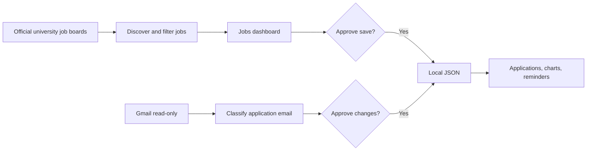

# University Job Tracker

A beginner-friendly Python project that demonstrates agentic thinking through a
real job-search workflow. The dashboard finds matching technology jobs on
official U.S. university job boards, reads job-application activity from Gmail,
tracks application status, calculates follow-up reminders, and asks for approval
before saving changes.

The target user is an international candidate looking for early career roles in:

- software development and engineering;
- frontend and UI development; and
- AI and machine learning engineering.

The tracker records STEM OPT and H-1B evidence when it is available. It leaves
sponsorship as `unclear` when a source does not explicitly answer the question.

## What works now

- **Automatic job discovery:** reads seven official university RSS, Atom, and
  Workday job sources without requiring an API key.
- **Relevant role filtering:** includes software, frontend, UI, programming,
  and AI roles while excluding senior, lead, management, and architect titles.
- **Structured job cards:** provides 24-hour, 3-day, 7-day, 30-day, university,
  role, and keyword filters with source descriptions, requirements, job details,
  and a button to the original posting.
- **Gmail connection:** uses Google OAuth and requests Gmail read-only access.
- **Automatic application tracking:** detects application confirmations,
  interviews, offers, rejections, and withdrawals from Gmail messages.
- **Approval gates:** shows the exact proposed JSON before discovered jobs,
  applications, status changes, settings, or outreach records are saved.
- **Local persistence:** stores approved data in an ignored local JSON file.
- **Dashboard reports:** shows application charts, job discovery charts,
  follow-up reminders, spreadsheet-style application tables, and CSV exports
  for applications and outreach history.
- **Duplicate outreach protection:** keeps a separate outreach history and
  checks normalized email addresses before recording another contact.
- **Educational CLI:** preserves the original assignment's command-line workflow
  for learning helper functions, validation, approval, and persistence.

## Current workflow



Public job searches and dashboard reads do not need approval. Any change to the
local JSON database is staged first and saved only after the user selects
**Approve and save**.

## Project structure

```text
.
├── dashboard.py          # Streamlit pages, charts, tables, and approval UI
├── job_discovery.py      # Official job sources, parsing, matching, filtering
├── gmail_service.py      # Gmail OAuth, search, retrieval, and MIME decoding
├── email_importer.py     # Email classification and application matching
├── dashboard_data.py     # Application and outreach CSV export
├── main.py               # Original educational command-line interface
├── tracker.py            # Application, status, reminder, and outreach tools
├── validation.py         # Input rules and normalization
├── storage.py            # JSON schema defaults and atomic approved writes
├── tests/
│   └── test_job_tracker.py
├── data/
│   └── applications.json # Created locally and excluded from Git
├── ARCHITECTURE.md       # Components, data model, and control flow
├── USER_GUIDE.md         # Complete dashboard instructions
├── DEVELOPMENT.md        # Testing and extension guide
├── GMAIL_SETUP.md        # Google Cloud and Gmail OAuth setup
├── DESIGN.md             # Assignment steps and design decisions
└── REFLECTION.md         # How this project demonstrates agentic systems
```

## Requirements

- Python 3.10 or newer
- Python 3.12 recommended
- Internet access for job discovery and Gmail
- A Google Cloud Desktop OAuth client for Gmail import

## Install and run

From the project directory:

```bash
python3.12 -m venv .venv
source .venv/bin/activate
python -m pip install -r requirements.txt
streamlit run dashboard.py
```

Open <http://localhost:8501> if the browser does not open automatically.

Use the dashboard in this order:

1. Open **Settings** and save the search goal.
2. Open **Jobs**. Discovery starts automatically and displays live matches.
3. Filter the list and open a job's original posting to apply.
4. Open **Connect Gmail** and complete the one-time OAuth setup.
5. Open **Inbox Sync** and scan application email from June 1, 2025 onward.
6. Review and approve detected application and status changes.
7. Use **Applications** and **Dashboard** for reports and reminders.

The dashboard has no manual application-entry form. Gmail confirmation messages
create application proposals, and later messages propose matching status changes.
A status-correction control remains available in case an email is classified
incorrectly.

## Gmail setup

Follow [GMAIL_SETUP.md](GMAIL_SETUP.md). The short version is:

1. create a Google Cloud project;
2. enable the Gmail API;
3. create a Desktop OAuth client;
4. upload its JSON file on **Connect Gmail**; and
5. select the Gmail account in Google's authorization screen.

The app never asks for a Gmail password. It stores the OAuth client file and
token locally, and both paths are excluded from Git.

## Job discovery sources

The dashboard currently reads official public feeds or boards for:

- University of Iowa;
- University of Chicago;
- Georgetown University;
- Arizona State University;
- Western Governors University;
- University of Southern California; and
- University of Texas at Dallas.

Opening **Jobs** runs discovery automatically. Results are cached for 30 minutes
so normal filter changes do not repeatedly request university servers. **Refresh
jobs now** clears that cache and performs a fresh scan.

For matching Workday and Atom listings, the tracker reads the official detail
payload and displays a shortened excerpt using the posting's original words. It
does not generate or rewrite job descriptions. Requirements, employment type,
requisition number, closing date, and explicit sponsorship language are shown
when the source provides them. Job leads are presented as cards and are not
exported as CSV.

Discovery is a search aid. A listing can close after it is found, and
sponsorship rules can depend on the position. Verify availability, requirements,
STEM OPT compatibility, and H-1B support on the original university page.

## Data and privacy

Approved records are stored in `data/applications.json`. The database contains:

- `search_goal`;
- `applications`;
- `outreach_history`;
- `job_leads`;
- `job_discovery` scan metadata; and
- `email_sync` scan metadata and processed Gmail message IDs.

The Gmail scanner processes message bodies in memory. It does not save full
message bodies. It saves identifiers, dates, application fields, and a short
subject-based note needed for deduplication and auditing.

These private files are ignored by Git:

- `credentials.json`;
- `data/gmail_token.json`;
- `data/applications.json`;
- `.env`; and
- `.streamlit/secrets.toml`.

## Run tests

```bash
source .venv/bin/activate
python -m unittest discover -s tests -v
```

The unit suite covers validation, follow-up dates, pipeline summaries, approval
behavior, atomic storage, application CSV output, Gmail classification and
matching, source-description extraction, job title filtering, time filtering,
relative dates, and job deduplication.

## Educational CLI

The original assignment requested a command-line app, so it remains available:

```bash
source .venv/bin/activate
python main.py
```

The CLI includes manual entry because it teaches the assignment's core helper
functions. The Streamlit dashboard uses the automatic Gmail workflow requested
for the working product.

## Documentation

- [USER_GUIDE.md](USER_GUIDE.md): page-by-page use and troubleshooting
- [ARCHITECTURE.md](ARCHITECTURE.md): data flow, modules, schemas, and safety
- [DEVELOPMENT.md](DEVELOPMENT.md): local development and adding integrations
- [GMAIL_SETUP.md](GMAIL_SETUP.md): Gmail OAuth configuration
- [DESIGN.md](DESIGN.md): assignment requirements and implementation decisions
- [REFLECTION.md](REFLECTION.md): agentic-thinking concepts demonstrated here

## Current limitations

- Job discovery covers seven universities; it is not yet a complete index of
  every U.S. university.
- Gmail scanning starts when the user selects **Scan Gmail**. A separate
  scheduler is required to scan while the dashboard is closed.
- Sponsorship evidence is conservative and usually starts as `unclear`.
- Google Sheets synchronization is not implemented; Applications and Outreach
  History can be exported as CSV.
- Gmail has read-only access. Email drafting and approval-gated sending are not
  implemented yet.
- OAuth and JSON storage are designed for one local user. A public multi-user
  deployment requires web OAuth, user accounts, and encrypted token storage.
